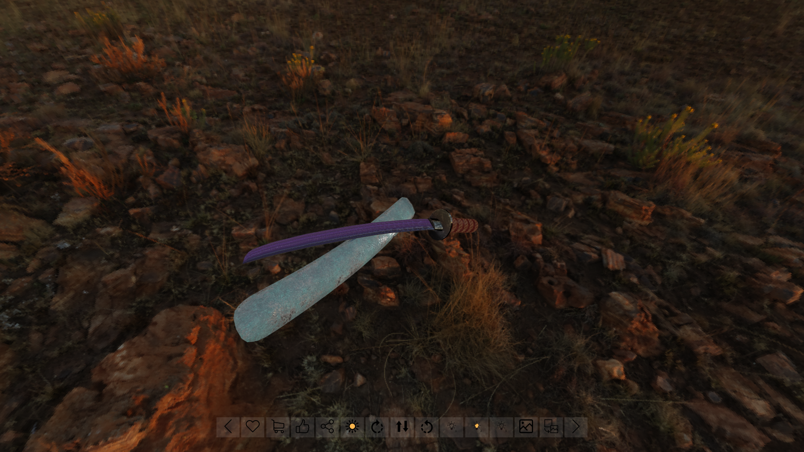
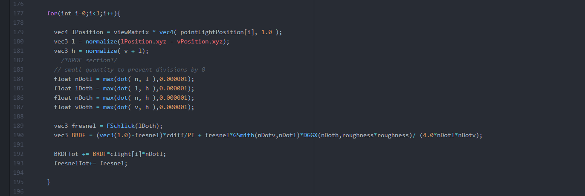
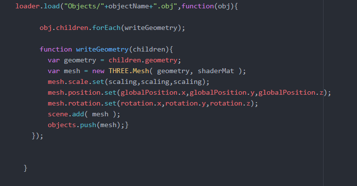
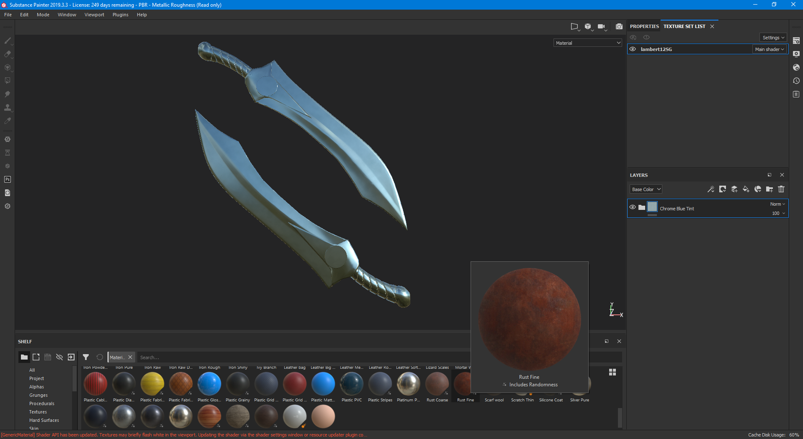
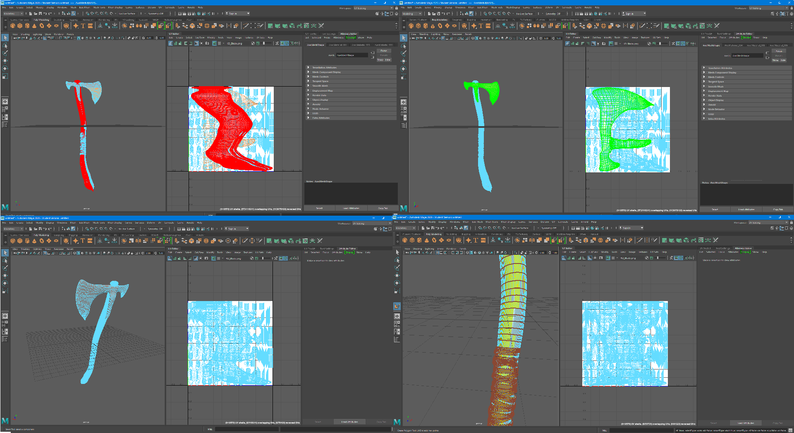
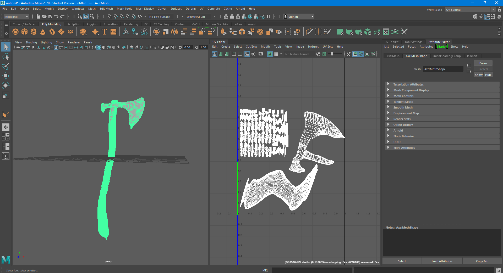
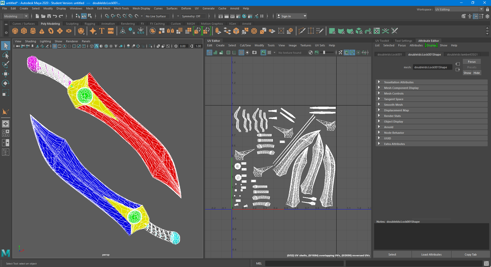

# Product Presentation : Weapons

## Caratteristiche

Il progetto proponone la visualizzazione di 4 tipi di armi bianche ciascuna disponibile in due diversi stili. I modelli sono stati reperiti dal sito: https://free3d.com/it/. La costruzione della scena fa uso di 3 librerie threejs, piu una quarta inserita nel codice per i test. Gli shader proposti fanno uso di 5 tipi di texture per rappresentare l'oggetto: componente diffusiva,componente speculare,roughness,ambient occlusion e normale. Grazie alla presenza di queste informazioni è stato possibile aggiungere le riflessioni ambientali, l'irradianza dovuta alla natura del materiale e ai fenomeni,se pur minimi dovuti alla natura delle mesh,dovuti all'occlusione ambientale delle superfici.
Il fragment-shader è stato realizzato per calcolare 3 punti luce differenti più uno ambientale che influenza l'impatto dell'ambiente sull'oggetto, è inoltre possible scegliere di quali luci far uso in ogni momento.

Nella visualizzazione vi è assenza di ombre in quanto viene proposto un unico oggetto non contestualizzato in un ambiente interattivo, e il paesaggio che viene proposto in background ha il solo scopo di fornire diverse prospettive e tipi di luce per l'oggetto. Per problemi dovuti all'eterogeneità delle mesh degli oggetti non è stato possibile creare una texturizzazione localizzata ai singoli componenti. Il motivo principale è l' assenza delle coordinate necessarie alla corretta disposizione dei componenti(cosa che avviene automaticamente nel caso di caricamento complessivo), secondariamente invece il numero eterogeno dei componenti degli oggetti avrebbe richiesto una funzione specifica di loader per ogni oggetto, cosa che avrebbe reso piu complesso e meno adattabile a nuovi oggetti il codice.

## Texture

Le texture proposte per ogni oggetto sono state tutte realizzate tramite Substance Painter ad eccezione di una già presente insieme all'oggetto(il pugnale con una scritta in rilievo sulla lama). Tramite Substance è stato possibile applicare alle mesh diversi tipi di materiali già presenti o di applicarne di personalizzati.

  

Terminata la realizzazione delle texture per ogni oggetto è sorto un problema dovuto all'esportazione delle immagini da substance, in particolare substance esportava un immagine per ogni componente dell'oggetto separatamente, e con una disposizione tale da non permettere un'unione delle immagini al fine di unificare il caricamento delle texture. Il problema risiedeva nella struttura delle mesh che venivano rilevate come insieme di più parti, anche unificando le componenti all'inerno di substance al momento dell'esportazione le immagini venivano sovraposte in modo errato. Per qesto è stato necessario l'utilizzo di Autodesk-Maya con la quale si è potuta modificare la tassellazione e la mappatura della mesh in modo da sistemarla su un unica immagine.

 
 Prima

 
 Dopo

 In questo processo tuttavia la definizione della mesh si è lievemente ridotta con la perdita di qualche tassello che risulta poco visibile dopo l'applicazione delle texture. Uno dei problemi principali dell'esportazione è diventata l'impossibilità di dividere l'oggetto in parti per l'applicazione dei materiali. Questo problema è stato risolto tramite il baking delle texture sulla mesh che prevede l'applicazione di un id di aggregazione per ogni triangolo che successivamente è stato usato come maschera per l'applicazione del materiale. L'assegnazione dell'id viene realizzata in Maya e riconosciuta da Substance.

Nell'immagine ogni colore rappresenta una delle categorie a cui possono appartenere i triangoli.

## Goals

The well-known ACME company has asked you to build a product **Web visualizer / configurator** for its new e-commerce site. Before giving you the job, ACME wants to evaluate how faithfully you can visualize and configure products.  ACME sells everything, so you can choose whatever kind of product you want for the demonstration.

Your goal is to build a Web application (a HTML page) that:

- visualizes a product in 3D using three.js, using PBR equations and materials;
- allows the user to inspect the product (e.g. by orbiting the camera around it), and change some material on it by choosing from a few alternatives.

Try to make it look like a simple, but real portion of an e-commerce site, not a three.js example: choose carefully colors, fonts, images, and icons, also taking inspiration from real web sites. Before starting, search the web for existing 3D configurators. Note down what you like and don't like, and try to produce a result as professional as possible.

## Steps (read CAREFULLY)

1. Prepare, and add to the repository, a journal.md file for logging your progress and choices.

2. Choose a product for which: (i) you can easily build a 3D model, or (ii) you can download a 3D model which you have the right to use in non-commercial applications. The model should not be too complex (not more than 100k vertices) and in some format that three.js can read. [Three.js examples](https://threejs.org/examples/) provide a list of loaders for different formats: beware that not all of them work perfectly, and you might have to try with different formats. Preferably, use GLTF, but any other format is ok.

3. Design the lighting for the product. Products in web sites and catalogues are photographed using strategically placed lights that enhance details and shape. For example, [searching google images for product photography lighting](http://www.google.com/images?q=product+photography+lighting) will show you a number of real-world lighting setups that are used for products. In your lighting setup, you can use whatever you want, from punctual lights, to environment map, or light maps, or any combination of them, but you *must include* an environment map.

4. Design the PBR materials for the product. You can use PRB textures found anywhere, or produce them, e.g. with Substance Designer or B2M. If you use textures authored by someone else, just make sure you have the rights for using them in our context (non-commercial application). At least one of the materials must have 2-3 alternatives (e.g. different colors, or materials).

5. Include tone mapping and, if needed, post-processing/color correction.

6. Build the application that renders the chosen 3D model, with the designed lighting setup and materials, and an user interface for selecting the material between the alternatives. You must use shaders written by you, e.g. by extending the shaders we saw in the classroom. Your report needs to describe the kind of BRDF / lights you have implemented.

7. If possible, try to take into account implicit requirements as well. For example, you cannot use textures with file sizes of dozens of megabytes for a Web site; and also, your page should render at least at 30 fps on average smartphones. You will get bonus points for a result that could be deployed to a Web site with few or no modifications.

8. (optional) include any technique that was not explained in the classroom, e.g. some special shader or post-processing technique. This will award you extra points in the evaluation.

9. Write a concise report by overwriting this file.
