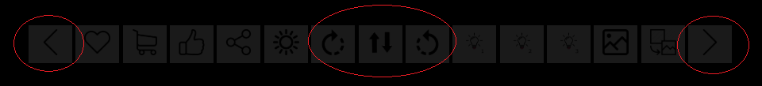

# Product Presentation : Weapons

## Caratteristiche

Il progetto proponone la visualizzazione di 4 tipi di armi bianche ciascuna disponibile in due diversi stili. I modelli sono stati reperiti dal sito: https://free3d.com/it/. La costruzione della scena fa uso di 3 librerie threejs, piu una quarta inserita nel codice per i test. Gli shader proposti fanno uso di 5 tipi di texture per rappresentare l'oggetto: componente diffusiva,componente speculare,roughness,ambient occlusion e normale. Grazie alla presenza di queste informazioni è stato possibile aggiungere le riflessioni ambientali, l'irradianza dovuta alla natura del materiale e ai fenomeni,se pur minimi dovuti alla natura delle mesh,dovuti all'occlusione ambientale delle superfici.
Il fragment-shader è stato realizzato per calcolare 3 punti luce differenti più uno ambientale che influenza l'impatto dell'ambiente sull'oggetto, è inoltre possible scegliere di quali luci far uso in ogni momento.

Nella visualizzazione vi è assenza di ombre in quanto viene proposto un unico oggetto non contestualizzato in un ambiente interattivo, e il paesaggio che viene proposto in background ha il solo scopo di fornire diverse prospettive e tipi di luce per l'oggetto. Per problemi dovuti all'eterogeneità delle mesh degli oggetti non è stato possibile creare una texturizzazione localizzata ai singoli componenti. Il motivo principale è l' assenza delle coordinate necessarie alla corretta disposizione dei componenti(cosa che avviene automaticamente nel caso di caricamento complessivo), secondariamente invece il numero eterogeno dei componenti degli oggetti avrebbe richiesto una funzione specifica di loader per ogni oggetto, cosa che avrebbe reso piu complesso e meno adattabile a nuovi oggetti il codice.

## Texture

Le texture proposte per ogni oggetto sono state tutte realizzate tramite Substance Painter ad eccezione di una già presente insieme all'oggetto(il pugnale con una scritta in rilievo sulla lama). Tramite Substance è stato possibile applicare alle mesh diversi tipi di materiali già presenti o di applicarne di personalizzati.

  

Terminata la realizzazione delle texture per ogni oggetto è sorto un problema dovuto all'esportazione delle immagini da substance, in particolare substance esportava un immagine per ogni componente dell'oggetto separatamente, e con una disposizione tale da non permettere un'unione delle immagini al fine di unificare il caricamento delle texture. Il problema risiedeva nella struttura delle mesh che venivano rilevate come insieme di più parti, anche unificando le componenti all'inerno di substance al momento dell'esportazione le immagini venivano sovraposte in modo errato. Per qesto è stato necessario l'utilizzo di Autodesk-Maya con la quale si è potuta modificare la tassellazione e la mappatura della mesh in modo da sistemarla su un unica immagine.

 
 Prima

 
 Dopo

 In questo processo tuttavia la definizione della mesh si è lievemente ridotta con la perdita di qualche tassello che risulta poco visibile dopo l'applicazione delle texture. Uno dei problemi principali dell'esportazione è diventata l'impossibilità di dividere l'oggetto in parti per l'applicazione dei materiali. Questo problema è stato risolto tramite il baking delle texture sulla mesh che prevede l'applicazione di un id di aggregazione per ogni triangolo che successivamente è stato usato come maschera per l'applicazione del materiale. L'assegnazione dell'id viene realizzata in Maya e riconosciuta da Substance.

Nell'immagine ogni colore rappresenta una delle categorie a cui possono appartenere i triangoli.

A causa dei problemi di ridimensionamto e posizionamento della mesh, sono stati scartati alcuni oggetti perchè restavano troppo danneggiati da questo processo e anche la maschera risultava compromessa rendendo impossibile una corretta visualizzazzione dell'oggetto.

## Navigazione

Per le modalità di navigazione è stato scelto un menù fisso posto in basso allo schermo in cui sono presenti diverse funzionalità come: l'accensione e lo spegnimento delle diverse fonti di luci, alcune funzionalità classiche di un si e-commerce come like/ aggiungi al carrello/agigungi ai preferiti, la possibilità di mostrare o meno un background. Per quanto riguarda l'oggetto invece sono presenti bottoni per cambiare tipo di prodotto o cambiarne le texture. Per la visualizzazione del prodotto invece è stato prefertito il classico OrbitControls.js che fornisce la rotazione e lo zoom della telecamera, per ragioni di comodità e sicurezza dell'utente è stata bloccata la funzionalità di traslazione. Per compensare è stata conferita la possibilità all'oggetto di ruotare sull'asse y.

Funzionalità comuni.

Gestione delle luci

Cambio prodotto alle due estremità, cambio texture al centro con rotazione sull'asse y ai lati.

Gestione dell'environment.
